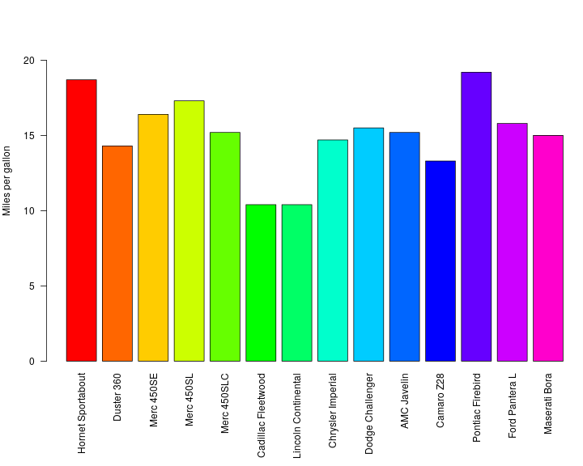

# Data From MT-Cars

Example of literate programming with the MT-cars data. Above we have added a title with markdown, here we are adding som text, and below there is a horizontal line.

***

## Introduction

Above there is a subtitle. Next, we will add an R code chunk. In order to get and process the data, we need the following libraries:

```r
library(dplyr)
```

```
## 
## Attaching package: 'dplyr'
```

```
## The following objects are masked from 'package:stats':
## 
##     filter, lag
```

```
## The following objects are masked from 'package:base':
## 
##     intersect, setdiff, setequal, union
```
This code chunk loads the dply library.

## Data Processing

Let's do some work with the MT-cars data and display the result. First, we subset the data to only include cars with more than 6 cylinders, and then we display the result.

```r
mtcars_subset <- subset(mtcars, mtcars$cyl > 6)
mtcars_subset
```

```
##                      mpg cyl  disp  hp drat    wt  qsec vs am gear carb
## Hornet Sportabout   18.7   8 360.0 175 3.15 3.440 17.02  0  0    3    2
## Duster 360          14.3   8 360.0 245 3.21 3.570 15.84  0  0    3    4
## Merc 450SE          16.4   8 275.8 180 3.07 4.070 17.40  0  0    3    3
## Merc 450SL          17.3   8 275.8 180 3.07 3.730 17.60  0  0    3    3
## Merc 450SLC         15.2   8 275.8 180 3.07 3.780 18.00  0  0    3    3
## Cadillac Fleetwood  10.4   8 472.0 205 2.93 5.250 17.98  0  0    3    4
## Lincoln Continental 10.4   8 460.0 215 3.00 5.424 17.82  0  0    3    4
## Chrysler Imperial   14.7   8 440.0 230 3.23 5.345 17.42  0  0    3    4
## Dodge Challenger    15.5   8 318.0 150 2.76 3.520 16.87  0  0    3    2
## AMC Javelin         15.2   8 304.0 150 3.15 3.435 17.30  0  0    3    2
## Camaro Z28          13.3   8 350.0 245 3.73 3.840 15.41  0  0    3    4
## Pontiac Firebird    19.2   8 400.0 175 3.08 3.845 17.05  0  0    3    2
## Ford Pantera L      15.8   8 351.0 264 4.22 3.170 14.50  0  1    5    4
## Maserati Bora       15.0   8 301.0 335 3.54 3.570 14.60  0  1    5    8
```
## Graphics

Graphics can easily be included in the report. Using the base barplot function: 


```r
par(mar=c(10,4,1,1),las=3)
barplot(mtcars_subset$mpg, names.arg=row.names(mtcars_subset),
     col=rainbow(15), ylab = "Miles per gallon", 
     ylim = c(0,max(mtcars_subset$mpg)))
```



